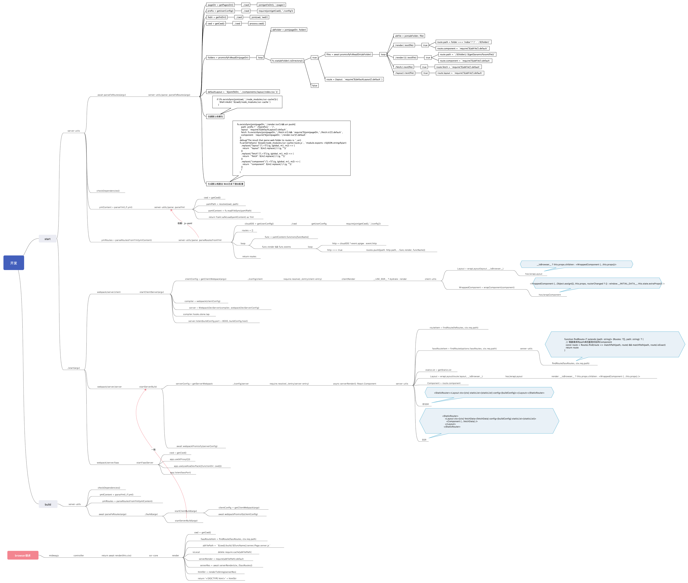

<h1 align="center">SSR</h1>
<div align="center">
  
</div>
<br />
<div align="center">
  <strong>A future-oriented ssr framework based on midway-faas that implemented serverless-side render specification for faas.</strong>
</div>
<br />
<a href="https://github.com/ykfe/ssr/actions" target="_blank"></a>
<a href="https://www.cypress.io/" target="_blank"></a>
<a href="https://npmcharts.com/compare/ssr-core" target="_blank"></a>
<a href="https://standardjs.com" target="_blank"></a>
<a href="https://github.com/ykfe/ssr" target="_blank"></a>
<a href="https://github.com/ykfe/ssr" target="_blank"></a>


ssr 框架是为前端框架在服务端渲染的场景下所打造的开箱即用的服务端渲染框架。  
是首个同时支持 React/Vue 的服务端渲染框架还可以一键以 Serverless 的形式发布上云。  
我们通过插件化的代码组织形式，支持任意服务端框架与任意前端框架的组合使用。开发者可以选择通过 Serverless 方式部署或是以传统 Node.js 的应用形式部署。  
并且我们专注于提升 Serverless 场景下服务端渲染应用的开发体验，打造了一站式的开发，发布应用服务的功能。最大程度提升开发者的开发体验，将应用的开发，部署成本降到最低。  
此框架脱胎于 [egg-react-ssr](https://github.com/ykfe/egg-react-ssr) 项目，我们在此之上做了诸多演进。如果你希望获得开箱即用的体验且能够一键部署上云。请选择 ssr 框架。

## Features

🚀 表示已经实现的功能

| 里程碑                                                                 | 状态 |
| ---------------------------------------------------------------------- | ---- |
| 支持任意服务端框架与任意前端框架的组合使用。(Serverless/Midway/Nest) + (React/Vue)             | 🚀   |
| 最小而美的实现服务端渲染功能                           | 🚀   |
| 针对Serverless 场景对代码包的大小的严格限制，将生产环境的代码包大小做到极致            | 🚀   |
| 同时支持约定式前端路由和声明式前端路由                            | 🚀   |
| React 场景下 All in JSX，抛弃传统模版引擎，所有部分包括 layout 布局皆使用 JSX 来编写生成                            | 🚀   |
| 渲染模式切换：服务端渲染一键降级为客户端渲染                            | 🚀   |
| 统一服务端客户端的数据获取方式                                 | 🚀   |
| 类型友好，全面拥抱 TS                                | 🚀   |
| 支持无缝接入 [antd](https://github.com/ant-design/ant-design) 无需修改任何配置                             | 🚀   |
| 支持使用 less 作为 css 预处理器                                                | 🚀   |
| 实现 React/Vue SSR 场景下的[优秀代码分割方案](https://zhuanlan.zhihu.com/p/343743374) 首屏性能做到极致                  |    🚀  |
| React 场景下使用 useContext + useReducer 实现极简的[数据管理](#React跨组件通信)，摒弃传统的 redux/dva 等数据管理方案                         |    🚀  |
| 支持在阿里云 [云平台](https://zhuanlan.zhihu.com/p/139210473)创建使用          | 🚀     |
| ssr deploy 一键部署到[阿里云](https://www.aliyun.com/)平台           | 🚀   |
| ssr deploy --tencent 无需修改任何配置一键部署到[腾讯云](https://cloud.tencent.com/)平台                                   | 🚀                                  |    |
| 支持 [vite](https://vite-design.surge.sh/) + [vue3](http://v3.vuejs.org/) 在 SSR 场景下的组合使用 |    |

## 线上案例

通过访问以下链接来预览该框架通过 Serverless 一键部署到阿里云/腾讯云服务的应用详情。通过使用 queryParams `csr=true` 来让 SSR 服务端模式一键降级为 CSR 客户端渲染模式，也可以通过 `config.js` 来进行配置。

- http://ssr-fc.com/ 部署到阿里云的 React SSR 应用
- http://ssr-fc.com?csr=true 部署到阿里云的 React SSR 应用, 以 CSR 模式访问
- http://tx.ssr-fc.com 部署到腾讯云的 React SSR 应用
- http://tx.ssr-fc.com?csr=true 部署到腾讯云的 React SSR 应用, 以 CSR 模式访问
- http://vue.ssr-fc.com 部署到阿里云的 Vue SSR 应用
- http://vue.ssr-fc.com?csr=true 部署到阿里云的 Vue SSR 应用, 以 CSR 模式访问
## Serverless for Developer

> Serverless 解放了端开发者（不仅仅是 Web 开发者）的生产力，让端开发者可以更快、更好、更灵活地开发各种端上应用，不需要投入太多精力关注于后端服务的实现。”

传统应用开发流程


Serverless 应用开发流程


使用本框架开发 Serverless SSR 应用开发流程


相比于传统服务端应用开发，我们将细节在底层统一抹平。前端开发者只需要关注业务逻辑，无需感知服务器的运行状况。成本和心智负担大大降低，只需要申请一个域名即可将应用发布到公网让所有用户可以访问。

## 哪些应用在使用

正在使用这个项目的公司(应用), 如果您正在使用但名单中没有列出来的话请提 issue，欢迎推广分享，我们将随时提供技术支持

<table>
<tr height="100">
<td align="center"><a target="_blank" href="http://youku.com/"><br />
 <sub><b>优酷视频
</b></td>
<td align="center"><a target="_blank" href="https://yulebao.alibaba.com/"><br><sub><b>阿里影业娱乐宝
</b></sub></a></td>
<td align="center"><a target="_blank" href="http://ssr-fc.com/"><br><sub><b>部署于阿里云示例应用
</b></sub></a></td>
<td align="center"><a target="_blank" href="http://tx.ssr-fc.com/"><br><sub><b>部署于腾讯云示例应用
</b></sub></a></td>
</tr>
</table>


## Getting Start

迅速开始一个应用
### 环境准备

```bash
$ node -v # 建议版本>=v10.15.0
v12.16.1
```
### create-ssr-app

我们提供了 [create-ssr-app](https://github.com/zhangyuang/create-ssr-app) 服务，可迅速创建不同类型的 example。如无特殊需求，我们推荐创建 Serverless 类型的应用，可享受一站式的应用开发，部署能力。

```bash
$ npm init ssr-app my-ssr-project --template=serverless-react-ssr # 创建 React SSR 应用，可通过 Serverless 服务一键发布应用上云
$ npm init ssr-app my-ssr-project --template=serverless-vue-ssr # 创建 Vue SSR 应用，可通过 Serverless 服务一键发布应用上云
$ npm init ssr-app my-ssr-project --template=midway-react-ssr # 创建 React SSR 应用，基于 Midway Node.js 框架提供的能力以传统 Node.js 应用的形式部署
$ npm init ssr-app my-ssr-project --template=midway-vue-ssr # 创建 Vue SSR 应用，基于 Midway Node.js 框架提供的能力以传统 Node.js 应用的形式部署
```

### 本地开发

```bash
$ npm i
$ npm start # 等价于 ssr start
$ open http://localhost:3000
```
### 资源构建

```bash
$ npm run build # 等价于 ssr build
$ GENERATE_ANALYSIS=true npm run build # 可视化生成构建产物
```

### 发布上云

发布命令

```bash
$ npm run deploy # 支持发布多个平台默认发布到阿里云 等价于 ssr deploy
$ npm run deploy:tencent # 发布到腾讯云 等价于 ssr deploy --tencent
```

### 本地调试

借助 [debug](https://github.com/visionmedia/debug) 模块的能力，开发者可以在本地开发过程中获取一些构建渲染过程的信息。

```bash
$ DEBUG=ssr:* npm start # 打印所有的 ssr 模块提供的 debug 信息
```

阅读下文以获得本应用更加详细的使用方式。包括应用组织规范以及如何配置域名使得用户可以在公网访问。
### 在阿里云使用

发布命令

```bash
$ npm run deploy # 支持发布多个平台默认发布到阿里云 等价于 ssr deploy
```

首次发布需要输入阿里云账户信息，并且在阿里云控制台开通函数计算服务。账户信息在函数计算[控制台](https://fc.console.aliyun.com/fc)查看。


将 AccountId 以及 Key Secret 在下面输入，只需要输入一次信息会储存在本地，之后 deploy 无需做该操作。


#### 阿里云配置域名

发布成功后得到一个临时的 http 地址`https://1812856288776972.cn-shanghai.fc.aliyuncs.com/***`。可以暂时用来预览服务，之后我们需要配置自己的域名通过 CNAME 的形式转发到该服务。  
`阿里云控制台域名服务` -> `域名解析设置` -> `函数计算控制台` -> `自定义域名`。之后打开[域名](http://ssr-fc.com)便能够访问发布的函数。


### 在腾讯云使用

无需做任何配置文件的修改即可一键发布到腾讯云！

发布命令

```bash
$ npm run dploy:tencent # 发布到腾讯云 等价于 ssr deploy --tencent
```

首次发布时需要使用微信扫终端展示的二维码注册/登陆腾讯云服务。  
如果想详细的了解腾讯云发布功能可参考[文档](https://www.yuque.com/midwayjs/faas/deploy_tencent_faq)
发布后同样我们可以得到平台返回的一个地址, 需要绑定域名后才能正确的访问页面渲染服务。否则由于访问 /test 路径造成服务端路由和客户端路由不一致会导致页面内容闪现后白屏。  
  
默认发布到测试环境, 这里建议在第一次发布后显示在 yml 中指定要发布的[serviceID](https://www.yuque.com/midwayjs/faas/deploy_tencent_faq), 否则每次发布将会创建一个新的 server 实例。  
在腾讯云[API](https://console.cloud.tencent.com/apigateway/service-detail)网关平台进行域名的绑定以及函数发布到正式环境的操作  
在腾讯云[SCF](https://console.cloud.tencent.com/scf)平台可以进行函数的管理调试以及日志查看
如何复用 serviceId 如下

```yml
service:
  name: serverless-ssr-spa
provider:
  name: aliyun # 无需修改 name 通过 ssr deploy --tencent 指定腾讯云即可
  region: ap-hongkong
  serviceId: service-xxx
```
#### 腾讯云配置域名

在发布到腾讯云时 midway-faas 支持通过 [provider.region](https://www.yuque.com/midwayjs/faas/serverless_yml) 来设置发布的服务器区域。  
如果发布的区域是国内则绑定的域名需要在腾讯云进行备案服务，如果是香港则无需备案。默认绑定域名后需要通过 [tx.ssr-fc.com/release](http://tx.ssr-fc.com) 来访问具体的环境。也可以通过自定义路径映射使得不需要添加 /release 也可以访问到具体的环境。


### 结合阿里云开发平台

本框架可结合阿里云开发平台，使用 CloudIDE 全程上云开发 Serverless SSR 应用使用方式可参考该[教程](https://zhuanlan.zhihu.com/p/139210473)。

### 结合 Midway.js

为了 cover 到所有的场景，我们也支持以 [Midway.js](https://midwayjs.org/) 作为 Node.js 框架以传统 Node.js 的服务进行部署。使用方式与 Serverless 场景类似。
可参考 midway 文档得到更详细的描述

```bash
$ npm init ssr-app my-ssr-project --template=midway-react-ssr # 创建 React SSR 应用，基于 Midway Node.js 框架提供的能力以传统 Node.js 应用的形式部署
```

通过上述命令创建基于 Midway 的 React SSR 应用后

```bash
$ npm i
$ npm start # 本地开发启动服务
$ open http://localhost:3000 # 访问应用
$ npm run build # 本地资源构建
$ npm run prod # 通过 egg-scripts 生产环境多进程模式运行
```
## 开发规范

`注：本规范适用于绝大多数的业务场景，我们已经尽力将默认的规范和配置做到最优如无特殊需求请不要额外定制`

### 通过插件组合功能

我们目前提供了如下插件

服务端框架插件

- plugin-faas 基于 midway-faas
- plugin-midway 基于 midway@2.0

前端框架插件

- plugin-react 基于 React
- plugin-vue 基于 Vue

它们之间可以任意的进行组合。如何在 example 中使用插件如下。

```js
// plugin.js

const { faasPlugin } = require('ssr-plugin-faas')
const { reactPlugin } = require('ssr-plugin-react')

module.exports = {
  serverPlugin: faasPlugin(),
  fePlugin: reactPlugin()
}

```
### 前端技术选型

不同的前端框架在技术选型方面会有一些差别，但我们尽量规定一套规范，使得不同框架之间的差异性做到最小，默认都使用约定式路由。如无特殊必要建议使用默认选项。  
在代码规范方面我们将一系列的 eslint-plugin 进行整合，使得只需要安装一个依赖即可同时检测 .vue|ts|tsx 文件
#### React

技术选型

- 前端框架: React v17, 实时跟进 React17的新特性
- 开发语言: TypeScript
- 代码风格: [eslint-config-standard-react-ts](https://github.com/zhangyuang/standardjs-react)
- 样式处理: less + css modules
- UI 组件: 默认已对 antd 的使用做打包配置无需额外配置
- 前端路由: 约定式路由/声明式路由
- 数据管理: 使用 React Hooks 提供的 useContext + useReducer 实现极简的[数据管理方案](#React跨组件通信), 摒弃传统的 redux/dva 等数据管理方案

#### Vue

技术选型

- 前端框架: Vue2.0, Vue3.0 将会在下一个版本与 Vite 一起推出
- 开发语言: TypeScript
- 代码风格: [eslint-config-standard-vue-ts](https://github.com/zhangyuang/standardjs-vue)
- 样式处理: less + vue scoped
- 前端路由: 约定式路由/声明式路由
- 数据管理: vuex

### 应用类型

由于本框架同时具备 SSR 服务端渲染能力 以及 loadable 代码分割能力。我们天生可以看作既是单页面应用也是多页面应用。表现如下

- 用户可以通过 react-router/vue-roueter 的形式进行页面之间的跳转。此时是纯前端的跳转不会向服务器发送请求视为单页面应用页面之间的互相跳转
- 同时用户也可以通过 a 标签的形式来进行页面之间的跳转。此时视为在服务端渲染一个新页面。视为多页面应用之间的互相跳转，由于我们具备 SSR 能力，此时页面的源代码是新页面具备 SEO 能力以及首屏直出页面能力
- 每个独立页面之间的代码是互相分离互不冗余的

#### 应用介绍

注意：

- 我们的策略是将所有负责页面渲染的服务端路由都对应同一个 FaaS 函数。例如 首页和详情页是打到同一个 FaaS 函数。共享函数的资源。优势是便于开发管理。且每一个服务端路由都可对应多个前端路由
- 如果你一定要将首页和详情页分别部署到不同的函数。我们建议你分成两个 Repo 分别进行开发部署

##### 目录结构

无论前端框架是 React/Vue, 我们 follow 同一套目录结构规范
这里我们使用约定式前端路由。无需手动声明路由配置文件，会根据文件夹名称及路径自动生成路由配置。

```bash
.
├── build # web目录构建产物
│   └── index # 函数名称
│       ├── client
│       └── server
├── config.js # 定义应用的配置
├── f.yml # 可选，Serverless 场景下需要创建
├── package.json
├── src # 存放服务端 Node.js 相关代码
│   └── index.ts
├── tsconfig.json
├── web # 存放前端组件相关代码
│   ├── components # 存放公共组件
│   │   └── header # 公共头部
│   │   │   ├── index.less
│   │   │   └── index.tsx
│   │   └── layout # 页面 html 布局
│   │       ├── index.less
│   │       └── index.tsx
│   ├── pages # pages目录下的文件夹会映射为前端路由，存放页面级别的组件
│   │   ├── index # index文件夹映射为根路由
│   │   │   ├── fetch.ts # 定义fetch文件用来统一服务端/客户端获取数据的方式，通过 __isBrowser__ 变量区分环境
│   │   │   ├── index.less
│   │   │   └── render.tsx # 定义render文件用来定义页面渲染逻辑
│   │   └── detail
│   │       ├── fetch.ts
│   │       ├── index.less
│   │       └── render$id.tsx # 映射为/detail/:id
│   │       └── render$id$.tsx # 映射为/detail/:id?
│   ├── tsconfig.json # 仅用于编辑器ts语法检测
│   └── typings.d.ts
```

##### yml 文件编写规范

```yml
service:
  name: serverless-ssr-spa
provider:
  name: aliyun
functions: # 函数列表
  index:
    handler: index.handler
    events: # 页面渲染服务
      - http:
          path: /
          method: get
      - http:
          path: /detail/*
          method: get
  api-index: # api 数据接口服务
    handler: api.handler
    events:
      - http:
          path: /api/index
          method: get
  api-detail:
    handler: api.detail.handler
    events:
      - http:
          path: /api/detail/*
          method: get
  render: # 静态资源目录
      handler: render.handler
      events:
        - http:
            path: /client/*
            method: get

aggregation: # 将上述 functions 聚合成一个 ssr 函数发布
  ssr:
    deployOrigin: false
    functionsPattern:
      - '*'

package:
  include:
    - build
  artifact: code.zip

```
##### 展示形式

http://ssr-fc.com/ -> ssr 函数 -> 渲染 index 组件  
http://ssr-fc.com/detail/* -> ssr 函数 -> 渲染 detail 组件
### 应用原理解析

点击[此处](./images/ykfe-ssr.png)查看高清大图


### FAQ

以下记录应用开发过程中常见问题
#### React跨组件通信

通过使用 `useContext` 来获取全局的 `context`, `useContext` 返回两个值分别为

- state: 全局的状态，可在不同的组件/页面之间共享
- dispatch: 通过 `disptach` 来触发类型为 `updateContext` 的 `action` 来更新全局的 `context`

`注: hooks 只能够在函数组件内部使用`

```ts
import { useContext } from 'react'
import { IContext } from 'ssr-types'

const { state, dispatch } = useContext<IContext<IData>>(window.STORE_CONTEXT) // 通过 IData 指定业务自己的 data interface
```

通过 `dispatch action` 来触发全局 `context` 的更新，并通知到所有的组件。  
`注: dispatch 是异步的只能够在客户端渲染的阶段使用，服务端使用无效。context 更新会导致所有组件重新 render 可根据实际情况使用 React.useMemo 来避免不必要的重新计算，且建议根据不同的模块使用不同的 namespace 防止数据覆盖`


```js
import React, { useContext } from 'react'
import styles from './index.less'

function Search (props) {
  const { state, dispatch } = useContext<IContext<SearchState>>(window.STORE_CONTEXT)
  const handleChange = e => {
    dispatch({
      type: 'updateContext',
      payload: {
        search: {
          // 搜索框模块的 namespace 为 search
          text: e.target.value
        }
      }
    })
  }
   return (
    <div className={styles.searchContainer}>
      {/* 这里需要给 value 一个兜底的状态 否则 context 改变 首次 render 的 text 值为 undefined 会导致 input 组件 unmount */}
      {/* ref: https://stackoverflow.com/questions/47012169/a-component-is-changing-an-uncontrolled-input-of-type-text-to-be-controlled-erro/47012342 */}
      <input type="text" className={styles.input} value={state.search?.text ?? ''} onChange={handleChange} placeholder="该搜索框内容会在所有页面共享"/>
      
    </div >
  )
}

export default Search

```

`注: 我们只推荐在跨组件通信时使用 dispatch，局部状态不推荐使用，会导致函数内部状态过于复杂，难以阅读。`

关于更多 hooks 使用的最佳实践可以参考该[文章](https://zhuanlan.zhihu.com/p/81752821)

#### 使用声明式路由

我们默认使用约定式路由通过文件夹结构自动生成路由表，如果无法满足应用需求也可以手动创建路由文件

```bash
$ touch web/route.js # 检测到该文件存在则使用声明式路由
```

并需要严格按照如下格式规范写入内容, 否则应用可能会执行出错, `__isBrowser__` 会在应用的执行过程当中根据环境自动注入。

```js
// React 使用如下规范
module.exports = [{
  layout: require('./components/layout/index.tsx').default,
  fetch: require('./pages/detail/fetch.ts').default,
  path: '/detail/:id',
  // component 使用这种规范来实现按需加载功能
  component: __isBrowser__ ? require('react-loadable')({ // __isBrowser__ 为 webpack 自动注入的变量，按照规范编写即可
    loader: async () => await import(/* webpackChunkName: "detail" */ './pages/detail/render$id.tsx'),
    loading: function Loading () {
      return require('react').createElement('div')
    }
  }) : require('./pages/detail/render$id.tsx').default,
  webpackChunkName: 'detail'
},
{
  layout: require('./components/layout/index.tsx').default,
  fetch: require('./pages/index/fetch.ts').default,
  path: '/',
  component: __isBrowser__ ? require('react-loadable')({
    loader: async () => await import(/* webpackChunkName: "index" */ './pages/index/render.tsx'),
    loading: function Loading () {
      return require('react').createElement('div')
    }
  }) : require('./pages/index/render.tsx').default,
  webpackChunkName: 'index'
}]
// Vue 使用如下规范
module.exports = [{
  layout: require('./components/layout/index.vue').default,
  App: require('./components/layout/App.vue').default,
  fetch: require('./pages/detail/fetch.ts').default,
  path: '/detail/:id',
  // component 使用这种规范来实现按需加载功能
  component: __isBrowser__ ?  async () => await import(/* webpackChunkName: "detail" */ './pages/detail/render$id.vue') : require('./pages/detail/render$id.vue').default,
  webpackChunkName: 'detail'
},
{
  layout: require('./components/layout/index.vue').default,
  fetch: require('./pages/index/fetch.ts').default,
  path: '/',
  component: __isBrowser__ ? async () => await import(/* webpackChunkName: "index" */ './pages/index/render.vue') : require('./pages/index/render.vue').default,
  webpackChunkName: 'index'
}]
```
#### 配置文件

config.js 支持以下配置, 默认配置已适用于绝大部分应用, 无特殊需求不要修改

```js
{
  mode: string; // 渲染模式，默认为 ssr
  stream: boolean; // 是否将组件编译成 Node.js.Stream 默认为 false 则编译为字符串
  cwd: string; // 设置命令执行的 cwd，默认为 process.cwd()，无特殊需求不需修改
  isDev: boolean; // 当前运行环境，默认为 process.env.NODE_ENV
  publicPath: string; // webpack-dev-server 的publishPath，默认为 /
  useHash: boolean; // 生成文件是否带有 hash，默认本地运行关闭，生产环境构建时开启
  serverPort: number; // 本地开发启动的 FaaS 服务的端口，默认为3000
  fePort: number; // 前端静态资源本地开发时的监听端口，默认为 8000, FaaS Server 会自动 proxy,无特殊需求不需要修改
  chunkName: string; // 生成的 bundle 的 chunkName，默认为Page,无特殊需求不要修改
  webpackDevServerConfig: webpackDevServer.Configuration; // webpack-dev-server 启动配置
  staticPrefix: string; // 加载的静态资源前缀，需要发布到单独的cdn服务时可以使用该配置设置为cdn服务的地址
  chainServerConfig: (config: Config) => Configuration; // 使用 webpack-chain 来修改服务端 wbepack 构建配置
  chainClientConfig: (config: Config) => Configuration; // 使用 webpack-chain 来修改服务端 wbepack 构建配置
  whiteList: RegExp[]; // 设置服务端构建配置 externals 的白名单，即需要让 webpack 来处理的模块
  cssModulesWhiteList: RegExp[]; // 设置该选项指定样式文件不用 css-modules 处理，防止样式和 className 不匹配
  prefix: string; // 为前端路由添加统一的prefix, 如 /${prefix}/, /${prefix}/detail/:id
  proxy: {
    // 底层使用 http-proxy-middleware 来进行代理, 具体配置查看 http-proxy-middleware 文档即可
   '/api': {
      target: 'xxx'
   }
  },
  dynamic?: boolean // 是否启用代码分割优化代码，默认为 true
  customeHeadScript?: Array<{ // 用于通过配置插入自定义的 script 为了避免影响期望功能这块内容不做 escape，为了避免 xss 需要保证插入脚本代码的安全性 
    describe: object // 参考 vue createElement https://cn.vuejs.org/v2/guide/render-function.html#createElement-%E5%8F%82%E6%95%B0
    content: string // 需要插入的 script 脚本内容
  }>
}

```
#### 如何让某个组件只在客户端渲染

我们有时候会遇到某个组件强依赖了浏览器元素导致无法在服务端渲染，这时候需要针对该组件让其只在客户端进行渲染。  
React 场景下只需要用 onlyCsr 高阶组件包裹一下即可

```bash
$ yarn add ssr-hoc-react
```

```js
import { onlyCsr } from 'ssr-hoc-react'

export onlyCsr(Component)
```

由于 Vue 对 HOC 的支持不友好，这里需要用户手动来实现该功能

1、组件新增 data 选项 isClient
2、在 mounted 生命周期设置 isClient 为 true
3、当 isClient 为 true 时，渲染真正的组件内容，否则只需要渲染一个空的 div

```js
<template>
  <div v-if="isClient">{xxx}</div>
  <div v-else="!isClient"></div>
</template>

export default {
  data () {
    return {
      isClient: false
    }
  }
  mounted () {
    this.isClient = true
  }
}
```

## CONTRIBUTING

如果你想为本应用贡献代码，请阅读[贡献文档](./CONTRIBUTING.md)，我们为你准备了丰富的脚本用于 bootstrap

## License

[MIT](LICENSE)

## 答疑群

虽然我们已经尽力检查了一遍应用，但仍有可能有疏漏的地方，如果你在使用过程中发现任何问题或者建议，欢迎提[issue](https://github.com/ykfe/ssr/issues)或者[PR](https://github.com/ykfe/ssr/pulls)
欢迎直接扫码加入钉钉群

