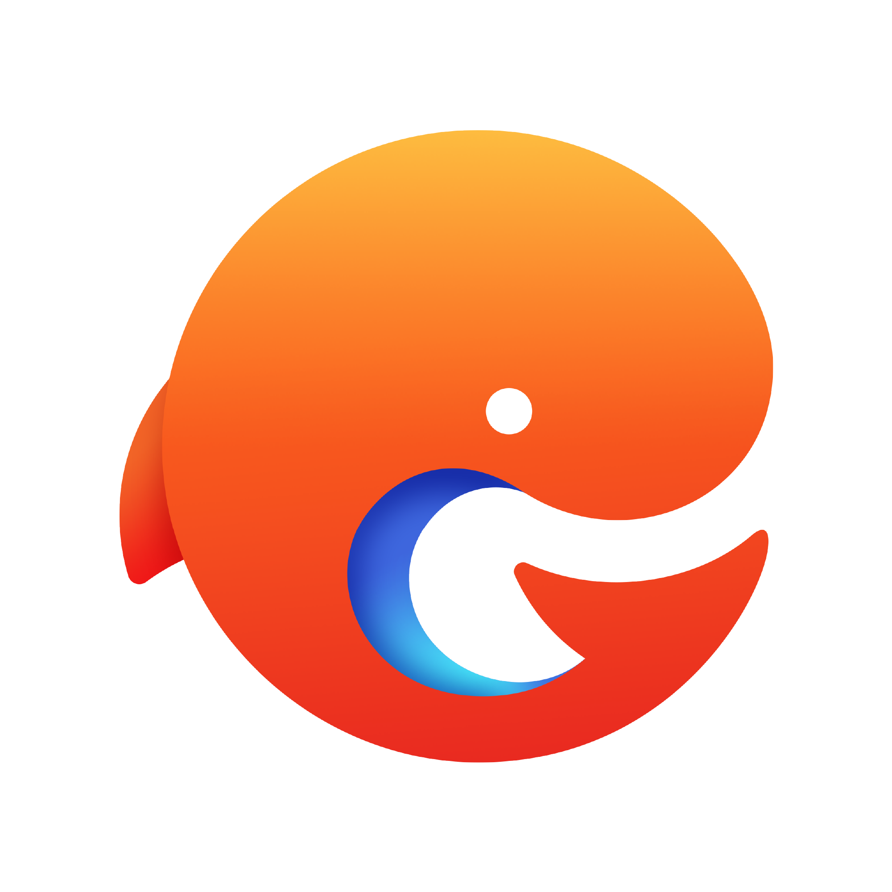
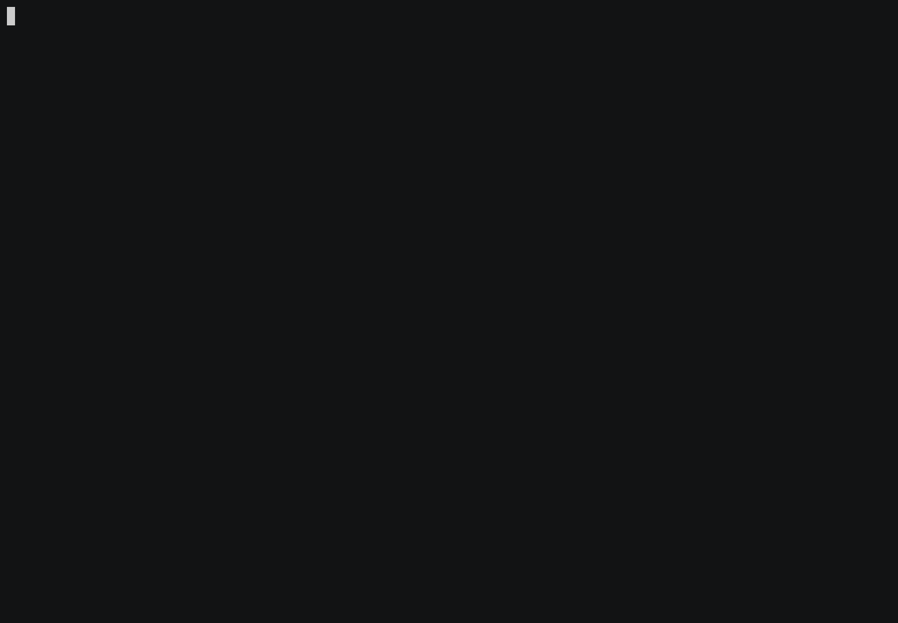

<div>
简体中文 ｜ <a href="./README_EN.md">English</a>
</div>

<h1 align="center"> SSR </h1>
<div align="center">
  
</div>
<br />

<div align="center">
  <strong>A most advanced ssr framework on Earth that implemented serverless-side render specification for faas and traditional web server.</strong>
</div>
<br />
<div align="center">
<a href="https://github.com/zhangyuang/ssr/actions" target="_blank">
<a href="https://www.cypress.io/" target="_blank">
<a href="https://github.com/zhangyuang/ssr" target="_blank"></a>
<a href="https://github.com/zhangyuang/ssr" target="_blank"></a>
</div>
<br />
   

`ssr` 框架是为前端框架在服务端渲染的场景下所打造的开箱即用的服务端渲染框架。了解什么是服务端渲染请查看[文档](http://doc.ssr-fc.com/docs/features$ssr)

此框架脱胎于 [egg-react-ssr](https://github.com/zhangyuang/egg-react-ssr) 项目和 `ssr` v4版本 `（midway-faas + react ssr）` ，在之前的基础上做了诸多演进，通过插件化的代码组织形式，支持任意服务端框架与任意前端框架的组合使用。开发者可以选择通过 `Serverless` 方式部署或是以传统 `Node.js` 的应用形式部署，并且我们专注于提升 `Serverless` 场景下服务端渲染应用的开发体验，打造了一站式的开发，发布应用服务的功能。最大程度提升开发者的开发体验，将应用的开发，部署成本降到最低。

在最新的版本中，同时支持 `React17/18` 和 `Vue2/Vue3` 作为服务端渲染框架且开发工具侧我们同样支持了最流行的 `Vite` 来提升应用的启动速度和 HMR 速度，且提供一键以 `Serverless` 的形式发布上云的功能。我们可以非常有自信说它是地球上最先进的 `ssr` 框架。如果你希望获得开箱即用的体验且能够一键部署上云，请选择 `ssr` 框架。

阅读我们的 [官方文档](http://doc.ssr-fc.com/) 获得更加详细的了解。事实上文档本身便是用 `ssr` 框架开发并通过 `Serverless` 部署到阿里云服务


## 什么情况下你应该选择 ssr 框架

* 需要在 `Node.js` 与前端框架结合的场景使用，与其他纯前端的框架不同 `ssr` 框架是专为服务端渲染场景或者 `Node.js` 与前端结合的场景打造的框架
* 需要一个开箱即用的服务端渲染能力，不需要手动去组合不同的前端框架与服务端框架之间的联系
* 需要框架层面的渲染降级能力，在服务端渲染出错时自动降级到客户端渲染
* 需要一个配置简单逻辑清晰的框架， `ssr` 框架的渲染逻辑和应用构建逻辑是同类型框架中最清晰的
* 可能会改动技术栈，如从 `Vue2` 升级为 `Vue3`，从 `Vue3` 降级为 `Vue2` 或 `React/Vue` 互相切换
* 需要在服务端渲染场景下开箱即用使用 `antd` `vant` 等流行 `ui` 库
* 需要能够同时支持 `Webpack`,  `Vite` 两种开发工具，以便同时得到快速的启动速度 `HMR` 速度以及稳定的生产环境代码
* 需要在 `Vue3 SSR` 使用 [pinia](https://pinia.vuejs.org/) 作为数据管理方案
* 只是单纯的需要一个更快更好用的 `cra` 或 `vue-cli`,  `ssr` 框架在纯 `csr` 场景的支持也十分优秀

## 哪些应用在使用

正在使用这个项目的公司(应用), 如果您正在使用但名单中没有列出来的话请提 [issue](https://github.com/zhangyuang/ssr/issues)，欢迎推广分享，我们将随时提供技术支持

<table>
<tr>
<td align="center"><a target="_blank" href="http://youku.com/"><br />
 <sub><b>优酷视频
</b></td>
<td align="center" style="width: 120px; "><a target="_blank" href="#"><br><sub><b>微信公众平台
</b></sub></a></td>
<td align="center" style="height: 100px"><a href="#" target="_blank"><br />
<a href="#" target="_bvlank"><b>腾讯体育
</b></a></td>
<td align="center" style="height: 100px"><a href="#" target="_blank"><br />
<a href="#" target="_bvlank"><b>QQ会员
</b></a></td>
<td align="center" style="height: 100px"><a href="https://m.film.qq.com/x/tva-vip-center/" target="_blank"><br />
<a href="https://m.film.qq.com/x/tva-vip-center/" target="_bvlank"><b>腾讯视频
</b></a></td>
<td align="center"><a href="https://www.niuniuda.com/mall" target="_blank"><br />
<a href="https://www.niuniuda.com/mall" target="_blank"><sub><b>牛牛搭
</b></a></td>
<td align="center"><a href="https://www.gszq.com/" target="_blank"><br />
<a href="https://www.gszq.com/" target="_bvlank"><sub><b>国盛证券
</b></a></td>
<td align="center"><a href="https://m.isle.org.cn" target="_blank"><br />
<a href="https://m.isle.org.cn" target="_bvlank"><sub><b>三易科技
</b></a></td>
<td align="center"><a href="https://wecard.qq.com/index/" target="_blank"><br />
<a href="https://wecard.qq.com/index/" target="_blank"><sub><b>腾讯微卡
</b></a></td>
</tr>
<tr>
<td align="center"><a href="https://syzs.qq.com/" target="_blank"><br />
<a href="https://syzs.qq.com/" target="_bvlank"><sub><b>腾讯手游助手
</b></a></td>
<td align="center"><a href="https://kcmall.b2bwings.com/home" target="_blank"><br />
<a href="https://kcmall.b2bwings.com/home" target="_bvlank"><sub><b>国家现代农业科技创新中心
</b></a></td>
<td align="center"><a target="_blank" href="http://ssr-fc.com/"><br><sub><b>部署于阿里云示例应用
</b></sub></a></td>
<td align="center"><a target="_blank" href="http://tx.ssr-fc.com/"><br><sub><b>部署于腾讯云示例应用
</b></sub></a></td>
<td align="center"><a href="https://www.100.com/" target="_blank"><br />
<a href="https://www.100.com/" target="_bvlank"><sub><b>100教育
</b></a></td>
<td align="center" style="height: 100px"><a href="https://blog.dreamer2q.wang/" target="_blank"><br />
<a href="https://blog.dreamer2q.wang/" target="_bvlank"><b>个人博客
</b></a></td>
<td align="center" style="height: 100px"><a href="https://jiawu.dewu.com" target="_blank"><br />
<a href="https://jiawu.dewu.com" target="_bvlank"><b>得物
</b></a></td>
<td align="center"><a href="https://www.myweimai.com/#sectionOne" target="_blank"><br />
<a href="https://www.myweimai.com/#sectionOne" target="_bvlank"><sub><b>微脉
</b></a></td>
<td align="center"><a href="hhttps://www.xdjy100.com/" target="_blank"><br />
<a href="https://www.xdjy100.com/" target="_bvlank"><sub><b>行动教育
</b></a></td>
</tr>
<tr>
<td align="center" style="height: 100px"><a href="https://www.habisummercamp.com/" target="_blank"><br />
<a href="https://www.habisummercamp.com/" target="_bvlank"><b>HappyPC
</b></a></td>
<td align="center" style="height: 100px"><a href="https://m.habisummercamp.com/" target="_blank"><br />
<a href="https://m.habisummercamp.com/" target="_bvlank"><b>HappyMobile
</b></a></td>
<td align="center" style="width: 120px; "><a target="_blank" href="https://yulebao.alibaba.com/"><br><sub><b>阿里影业娱乐宝
</b></sub></a></td>
<td align="center"><a target="_blank" href="https://campaign.vmate.com/vrbollywood"><br />
  <a target="_blank" href="https://job.alibaba.com/zhaopin/position_detail.htm?trace=qrcode_share&positionCode=GP524819"><sub><b>Vmate短视频
</b></a></td>
<td align="center"><a target="_blank" href="https://enjoysales.paat.com/"><br />
<a target="_blank" href="https://enjoysales.paat.com/"><sub><b>火炽星原CRM
</b></a></td>
<td align="center" style="height: 100px"><a href="https://www.paixin.com/" target="_blank"><br />
<a href="https://www.paixin.com/" target="_bvlank"><b>拍信创意
</b></a></td>
<td align="center"><a href="https://www.66tools.com/" target="_blank"><br />
<a href="https://www.66tools.com/" target="_bvlank"><sub><b>极速二维码
</b></a></td>
<td align="center"><a href="https://help.seewo.com/" target="_blank"><br /><a href="https://help.seewo.com/" target="_blank"><sub><b>希沃帮助中心
</b></a></td>
<td align="center"><a href="https://n8n8.cn/" target="_blank"><br /><a href="https://n8n8.cn/" target="_blank"><sub><b>经传多赢股票网
</b></a></td>
</tr>
<tr>
<td align="center"><a href="https://www.sinovip.cn/home" target="_blank"><br /><a href="https://www.sinovip.cn/home" target="_blank"><sub><b>中商全球图书采选平台
</b></a></td>
</tr>
</table>

## Features

* 🌱　极易定制：前端支持 React17/React18/Vue2/Vue3 等现代Web框架；
* 🚀　开箱即用：内置 10+ 脚手架配套扩展，如 [Pinia](https://pinia.vuejs.org/introduction.html#basic-example)、[antd](https://ant.design/components/overview-cn/)、[vant](https://github.com/youzan/vant)、TypeScript、Hooks等；
* 🧲　插件驱动：基于插件架构，用户更加专注于业务逻辑；
* 💯　Serverless优先：一键发布到各种Serverless平台，也支持传统Web Server，比如Egg、Midway、Nest等。
* 🛡　高可用场景，可无缝从SSR降级到CSR，最佳容灾方案。
* 😄　功能丰富，构建工具同时支持 Webpack/Vite，支持四种渲染模式 `SSR|CSR|SSG|Html`
* ✨ 支持 [bun](https://bun.sh/) 作为 js runtime

## 已实现的功能

🚀 表示已经实现的功能

| 里程碑                                                                                                                                                                                                                                          | 状态 |
| ----------------------------------------------------------------------------------------------------------------------------------------------------------------------------------------------------------------------------------------------- | ---- |
| 支持任意服务端框架与任意前端框架的组合使用。(Serverless/Midway/NestJS) + (React17/React18/Vue2/Vue3)                                                                                                                                                      | 🚀    |
| 最丝滑的 [vite](https://vite-design.surge.sh/) [支持](http://doc.ssr-fc.com/docs/features$vite)                                                                                                                                                 | 🚀    |
| 最小而美的实现服务端渲染功能                                                                                                                                                                                                                    | 🚀    |
| 支持[预渲染](http://doc.ssr-fc.com/docs/features$ssg)能力                                                                                                                                                                                                                   | 🚀    |
| 针对Serverless 场景对代码包的大小的严格限制，将生产环境的代码包大小做到极致                                                                                                                                                                     | 🚀    |
| 同时支持约定式前端路由和声明式前端路由                                                                                                                                                                                                          | 🚀    |
| 摒弃传统模版引擎，所有页面元素统一使用前端组件作为 DSL                                                                                                                                                                                          | 🚀    |
| 同时支持四种渲染模式，提供服务端渲染一键降级为客户端渲染的能力                                                                                                                                                                                  | 🚀    |
| 统一不同框架服务端客户端的数据获取方式，做到高度复用                                                                                                                                                                                            | 🚀    |
| 类型友好，全面拥抱 TS                                                                                                                                                                                                                           | 🚀    |
| 支持无缝接入 [antd](https://github.com/ant-design/ant-design) [vant](https://vant-contrib.gitee.io/vant/#/) 无需修改任何配置                                                                                                                    | 🚀    |
| 支持使用 less 作为 css 预处理器                                                                                                                                                                                                                 | 🚀    |
| 微前端场景下无缝[使用](http://doc.ssr-fc.com/docs/features$faq#%E4%B8%8E%20micro-app%20%E7%BB%93%E5%90%88%E4%BD%BF%E7%94%A8)                                                                                                                    | 🚀    |
| 支持使用 context 或 [valtio](https://github.com/pmndrs/valtio) 实现极简的[数据管理](http://doc.ssr-fc.com/docs/features$communication#React%20%E5%9C%BA%E6%99%AF)方案，摒弃传统的 redux/dva 等数据管理方案                                                                                         | 🚀    |
| Vue3 场景提供 [Pinia](https://pinia.vuejs.org/introduction.html#basic-example) 以及 [Provide/Inject](http://doc.ssr-fc.com/docs/features$communication#Vue%20%E5%9C%BA%E6%99%AF%E8%A7%A3%E5%86%B3%E6%96%B9%E6%A1%88) 代替 `Vuex` 进行跨组件通信 | 🚀    |
| 支持在阿里云 [云平台](https://zhuanlan.zhihu.com/p/139210473)创建使用                                                                                                                                                                           | 🚀    |
| ssr deploy 一键部署到[阿里云](https://www.aliyun.com/)平台                                                                                                                                                                                      | 🚀    |
| ssr deploy --tencent 无需修改任何配置一键部署到[腾讯云](https://cloud.tencent.com/)平台                                                                                                                                                         | 🚀    |

## 方案对比

为什么要选择 `ssr` 框架以及与同类型框架的方案对比请查看[文档](http://doc.ssr-fc.com/docs/why)

## 快速开始

我们提供了 [create-ssr-app](https://github.com/zhangyuang/create-ssr-app) 脚手架来让用户可以迅速的创建不同类型的应用。

目前官方提供了以下类型的模版给开发者直接使用。用户可根据自己的实际技术栈选择不同的模版进行开发。

虽然技术栈不同但开发思想是一致的，在任何技术栈的组合中我们的开发命令, 构建命令以及渲染原理都是完全一致的

注意: 在 `Midway.js`  `Nest.js` 场景下我们都已实现了一键部署到 `Serverless` 平台的能力。但底层实现略有差异。更加详细的介绍可以阅读 [Serverless](http://doc.ssr-fc.com/docs/features$serverless) 章节。如需要大量使用 `Serverless` 平台提供的能力，我们建议创建 `Midway.js` 类型的应用。强烈建议阅读我们的 [官方文档](http://doc.ssr-fc.com/) 来获得更加详细的了解

* [nestjs-react-ssr](https://github.com/zhangyuang/ssr/tree/dev/example/nestjs-react-ssr)
* [nestjs-react18-ssr](https://github.com/zhangyuang/ssr/tree/dev/example/nestjs-react18-ssr)
* [nestjs-vue-ssr](https://github.com/zhangyuang/ssr/tree/dev/example/nestjs-vue-ssr)
* [nestjs-vue3-ssr](https://github.com/zhangyuang/ssr/tree/dev/example/nestjs-vue3-ssr)
* [nestjs-vue3-ssr-pinia](https://github.com/zhangyuang/nestjs-vue3-ssr-pinia)
* [midway-react-ssr](https://github.com/zhangyuang/ssr/tree/dev/example/midway-react-ssr)
* [midway-react18-ssr](https://github.com/zhangyuang/ssr/tree/dev/example/midway-react18-ssr)
* [midway-vue-ssr](https://github.com/zhangyuang/ssr/tree/dev/example/midway-vue-ssr)
* [midway-vue3-ssr](https://github.com/zhangyuang/ssr/tree/dev/example/midway-vue3-ssr)

开发者可根据实际技术栈需要创建不同类型的应用快速开始

### 创建项目

通过 `npm init` 命令我们可以创建上述的任意模版

```bash
$ npm init ssr-app my-ssr-project
$ cd my-ssr-project
$ yarn # 建议使用 yarn, 也可以 npm install
$ yarn start
$ open http://localhost:3000 # 访问应用
$ yarn build # 资源构建，等价于 npx ssr build
$ yarn start:vite # 以 vite 模式启动，等价于 npx ssr start --vite
```



## 线上案例

通过访问以下链接来预览该框架通过 Serverless 一键部署到阿里云/腾讯云服务的应用详情。
通过使用 queryParams `csr=true` 来让 SSR 服务端渲染模式一键降级为 CSR 客户端渲染模式，也可以通过 `config.js` 来进行配置。

* http://ssr-fc.com/ 部署到阿里云的 React SSR 应用
* http://ssr-fc.com?csr=true 部署到阿里云的 React SSR 应用, 以 CSR 模式访问
* http://tx.ssr-fc.com 部署到腾讯云的 React SSR 应用
* http://tx.ssr-fc.com?csr=true 部署到腾讯云的 React SSR 应用, 以 CSR 模式访问
* http://vue.ssr-fc.com 部署到阿里云的 Vue SSR 应用
* http://vue3.ssr-fc.com 部署到阿里云的 Vue3 SSR 应用
* http://vue.ssr-fc.com?csr=true 部署到阿里云的 Vue SSR 应用, 以 CSR 模式访问
* http://vue3.ssr-fc.com?csr=true 部署到阿里云的 Vue3 SSR 应用, 以 CSR 模式访问

## 生态系统

| Project             | Status                                           | Description                                                             |
| ------------------- | ------------------------------------------------ | ----------------------------------------------------------------------- |
| [ssr]               | [![ssr-status]][ssr]                             | cli for ssr framework                                                   |
| [ssr-core]      | [![ssr-core-status]][ssr-core]           | core render for all framwork                                                     |
| [ssr-plugin-midway] | [![ssr-plugin-midway-status]][ssr-plugin-midway] | provide start and build fetature by [midway@2.0](https://midwayjs.org/) |
| [ssr-plugin-nestjs] | [![ssr-plugin-nestjs-status]][ssr-plugin-nestjs] | provide start and build feature by [NestJS](https://docs.nestjs.com/)   |
| [ssr-plugin-react]  | [![ssr-plugin-react-status]][ssr-plugin-react]   | develop react application only be used in development                   |
| [ssr-plugin-vue]    | [![ssr-plugin-vue-status]][ssr-plugin-vue]       | develop vue2 application only be used in development                    |
| [ssr-plugin-vue3]   | [![ssr-plugin-vue3-status]][ssr-plugin-vue3]     | develop vue3 application only be used in development                    |
| [ssr-common-utils]  | [![ssr-common-utils-status]][ssr-common-utils]   | common utils in Node.js environment and browser                         |
| [ssr-hoc-react]     | [![ssr-hoc-react-status]][ssr-hoc-react]         | provide hoc component for react                                         |
| [ssr-hoc-vue3]      | [![ssr-hoc-vue3-status]][ssr-hoc-vue3]           | provide hoc component for vue3                                          |
| [ssr-types]         | [![ssr-types-status]][ssr-types]                 | provide common types                                                    |
| [ssr-webpack]       | [![ssr-webpack-status]][ssr-webpack]             | start local server and build production bundle by webpack               |

[ssr-status]: https://img.shields.io/npm/v/ssr.svg
[ssr-core-status]: https://img.shields.io/npm/v/ssr-core.svg
[ssr-hoc-react-status]: https://img.shields.io/npm/v/ssr-hoc-react.svg
[ssr-hoc-vue3-status]: https://img.shields.io/npm/v/ssr-hoc-vue3.svg
[ssr-common-utils-status]: https://img.shields.io/npm/v/ssr-common-utils.svg
[ssr-plugin-midway-status]: https://img.shields.io/npm/v/ssr-plugin-midway.svg
[ssr-plugin-nestjs-status]: https://img.shields.io/npm/v/ssr-plugin-nestjs.svg
[ssr-plugin-react-status]: https://img.shields.io/npm/v/ssr-plugin-react.svg
[ssr-plugin-vue-status]: https://img.shields.io/npm/v/ssr-plugin-vue.svg
[ssr-plugin-vue3-status]: https://img.shields.io/npm/v/ssr-plugin-vue3.svg
[ssr-webpack-status]: https://img.shields.io/npm/v/ssr-webpack.svg
[ssr-types-status]: https://img.shields.io/npm/v/ssr-types.svg

[ssr]: https://github.com/zhangyuang/ssr/tree/dev/packages/cli
[ssr-core]: https://github.com/zhangyuang/ssr/tree/dev/packages/core
[ssr-hoc-react]: https://github.com/zhangyuang/ssr/tree/dev/packages/hoc-react
[ssr-hoc-vue3]: https://github.com/zhangyuang/ssr/tree/dev/packages/hoc-vue3
[ssr-plugin-midway]: https://github.com/zhangyuang/ssr/tree/dev/packages/plugin-midway
[ssr-common-utils]: https://github.com/zhangyuang/ssr/tree/dev/packages/utils
[ssr-plugin-nestjs]: https://github.com/zhangyuang/ssr/tree/dev/packages/plugin-nestjs
[ssr-plugin-react]: https://github.com/zhangyuang/ssr/tree/dev/packages/plugin-react
[ssr-plugin-vue]: https://github.com/zhangyuang/ssr/tree/dev/packages/plugin-vue
[ssr-plugin-vue3]: https://github.com/zhangyuang/ssr/tree/dev/packages/plugin-vue3
[ssr-types]: https://github.com/zhangyuang/ssr/tree/dev/packages/types
[ssr-webpack]: https://github.com/zhangyuang/ssr/tree/dev/packages/webpack

## CONTRIBUTING

如果你想为本应用贡献代码，请阅读[贡献文档](./CONTRIBUTING.md)，我们为你准备了丰富的脚本用于 bootstrap

## License

[MIT](LICENSE)

## 答疑群

虽然我们已经尽力检查了一遍应用，但仍有可能有疏漏的地方，如果你在使用过程中发现任何问题或者建议，欢迎提[issue](https://github.com/zhangyuang/ssr/issues)或者[PR](https://github.com/zhangyuang/ssr/pulls)

 `注: 由于微信交流群人数限制，进群请添加私人二维码并备注进入 ssr 交流群，由于是私人微信，拉群后将会自行删除好友，敬请谅解。我们更加鼓励通过 issue 和 discussion 来交流问题`

<div style="display:flex">
<!--  -->

</div>

## 项目捐赠

如果本项目能够对你有所帮助，希望得到来自于你的捐赠 ☕️ 为开源社区做一份贡献
<div style="display:flex">


</div>

## 代码行数

```bash
$ cloc packages --include-ext=ts
     993 text files.
     679 unique files.
     829 files ignored.

github.com/AlDanial/cloc v 1.90  T=0.62 s (264.7 files/s, 9026.5 lines/s)
-------------------------------------------------------------------------------
Language                     files          blank        comment           code
-------------------------------------------------------------------------------
TypeScript                     164            471            195           4927
-------------------------------------------------------------------------------
SUM:                           164            471            195           4927
-------------------------------------------------------------------------------
```

## 前端开发手册

[如何打造舒适高效的前端开发环境](http://fe.ssr-fc.com/) 

## 项目 Star 数增长趋势

[](https://starchart.cc/zhangyuang/ssr)
